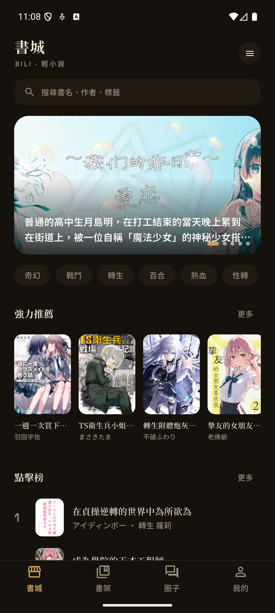
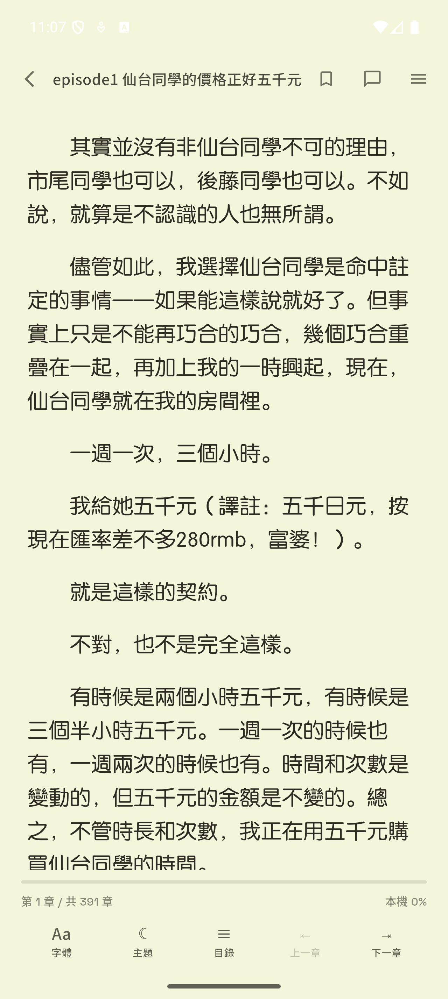
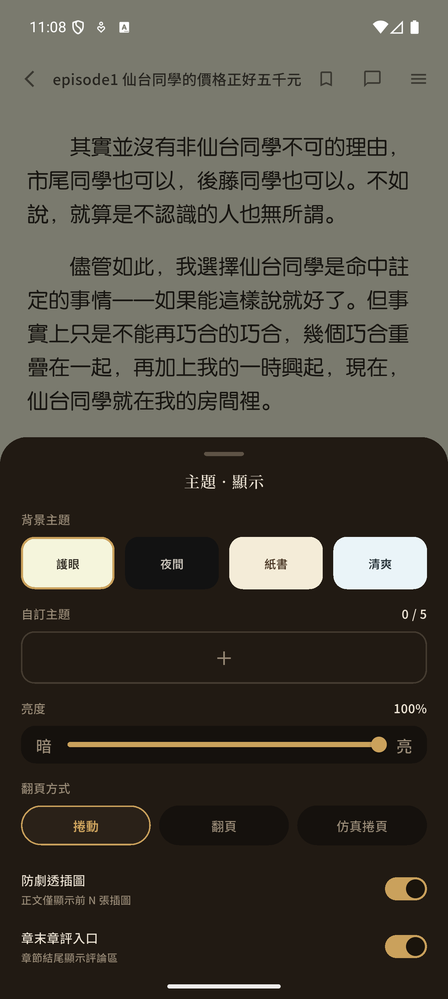
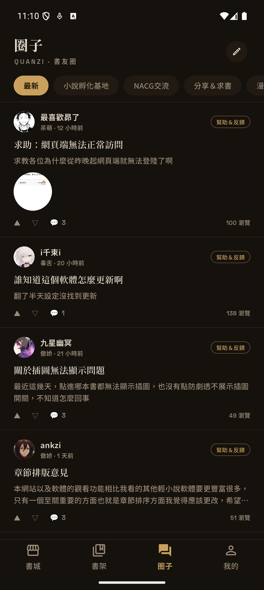
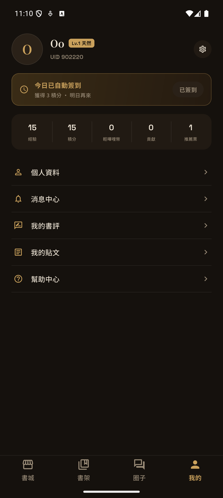

<div align="center">
  <h1>BiliReader</h1>
  <p><strong>用 Flutter 重製的小說閱讀 App。</strong></p>
  <p>書城探索、沉浸閱讀、書架管理、社群互動與即時通知。</p>
</div>

<p align="center">
  
</p>

## 概覽

BiliReader 是一個跨平台閱讀器的技術重構與架構實踐專案。官方嗶哩輕小說目前僅提供 Android 客戶端，本專案以逆向研究整理出的 API、資料模型與通訊行為為基礎，使用 Flutter 重建主要使用流程。

Repo內容包含 Flutter App、設計稿、截圖等文件，但不包含逆向過後得出的分析檔，有興趣請自行逆向或是研析這個專案的 Flutter 程式碼。

## 功能

| 模組 | 內容 |
| --- | --- |
| 探索 | 書城首頁、分類、排行榜、搜尋、書籍詳情、推薦 |
| 閱讀 | 捲動、水平翻頁、仿真捲頁、字體、主題、亮度、書籤、進度 |
| 書架 | 收藏、繼續閱讀、本機快取、離線閱讀 |
| 社群 | 圈子、貼文、回覆、書評、章節評論、互動按鈕 |
| 即時 | 通知中心、私訊、WebSocket 更新、未讀狀態 |
| 作者 | 作品管理、章節編輯、封面與插圖上傳 |

<details>
<summary>更多畫面</summary>

<table>
  <tr>
    <td align="center" width="25%"><br /><sub>書城</sub></td>
    <td align="center" width="25%"><br /><sub>搜尋</sub></td>
    <td align="center" width="25%"><br /><sub>書架</sub></td>
    <td align="center" width="25%"><br /><sub>詳情</sub></td>
  </tr>
  <tr>
    <td align="center" width="25%"><br /><sub>閱讀器</sub></td>
    <td align="center" width="25%"><br /><sub>閱讀設定</sub></td>
    <td align="center" width="25%"><br /><sub>圈子</sub></td>
    <td align="center" width="25%"><br /><sub>我的</sub></td>
  </tr>
</table>

</details>

## 技術棧

| 類別 | 技術 |
| --- | --- |
| App | Flutter、Material 3 |
| 狀態管理 | Riverpod、riverpod_generator |
| 路由 | go_router |
| 網路 | Dio、WebSocket |
| 本機資料 | drift、SQLite、secure storage、shared_preferences |
| 資料模型 | freezed、json_serializable |
| 文字轉換 | OpenCC 字典，離線簡轉繁 |

## 專案結構

```text
bili/
├─ bilireader/       Flutter App
├─ design/           HTML 高保真設計稿
├─ docs/images/      README 截圖與展示圖
└─ LICENSE
```

## 本機啟動

請先安裝 Flutter stable，並準備 Android 或 iOS 模擬器 / 實機。

```bash
cd bilireader
flutter pub get
dart run build_runner build --delete-conflicting-outputs
flutter run
```

## 檢查

```bash
flutter analyze
flutter test
```

## 授權

本專案採用 [BiliReader Non-Commercial Source Available License v1.0](LICENSE)。

| 允許 | 禁止 | 要求 |
| --- | --- | --- |
| 個人、教育、研究用途 | 商業使用、營利服務、廣告變現、企業內部商業使用 | 標註 `BiliReader` 與原作者 `t2o0n321` |
| 閱讀、學習、fork、修改 | 上架或發布到任何 App 商店、套件平台、外掛市集或軟體發布平台 | 保留授權與著作權聲明 |
| 分享原始碼或修改後的原始碼 | 移除署名、暗示原作者背書衍生版本 | 修改版需沿用同一授權 |

這是 source-available、non-commercial 授權，不是 OSI 定義下的開源授權。

## 聲明

原 App、商標、書籍封面、圖片、API 服務與其他第三方內容的權利歸其各自權利方所有；本授權不授予任何第三方素材或服務的使用權。
